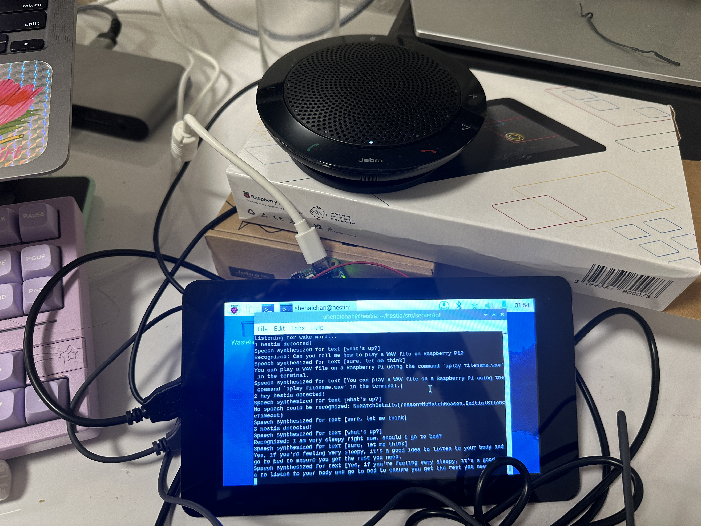
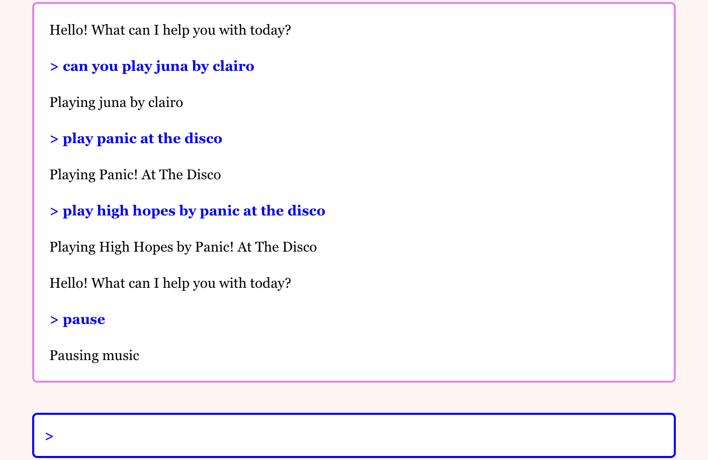

<h2 align="center"><i>Hestia</i></h2>

  
    

### Intro
Hestia is an open-source, continually-in-progress home assistant. As of November 5th, 2024, she can answer questions, play music, and set timers. You can either say "hey hestia!" to speak to her, or type to her via a web chat client, served by a locally-exposed web server running on your computer of choice (e.g., a Raspberry Pi).

### Built With
- 
- 
- 
- 
- 
- 
- 

## Table of Contents
- [High-Level Design Considerations](#high-level-design-considerations)
- [Hardware](#hardware)
- [Communication Design](#communication-design)
- [Web Dashboard](#web-dashboard)
- [Voice Interface](#voice-interface)
- [Current Functionality](#current-functionality)
- [License](#license)

## High-Level Design Considerations
Hestia was designed as an alternative to home assistants such as Alexa and Google Home. I wanted the freedom to implement functionalities tailored for my personal use -- e.g., Spotify over Amazon Music. 

I also wanted control over my data. I wanted to develop a device I knew would be private and secure -- the chat interface is exposed only over my local network; I use an on-board wake word model to detect a user's desire to initiate a conversation; I know the APIs I'm using aren't saving my data and using it to train models; etc. 

Right now, requests are routed through Azure's speech detection API & OpenAI's API, but I eventually would like to figure out a local/on-board speech transcription/LLM solution. 

## Hardware
I am currently running Hestia on Raspberry Pi 5, with a Jabra Speak 410 as my combination speaker-microphone for the voice interface. The RPi is also equipped with a 7" Raspberry Pi brand touch screen to display the web dashboard.

## Communication Design
There are three major processes running at all times:
- [The voice interface]()
- [The web server]()
- [The timer manager]()

These processes communicate with each other using an MQTT publish-subscribe broker running on my Raspberry Pi. For example, the web server subscribes to the "commands" topic, so that when the voice interface process transcribes a command, it can publish the command over the topic for the web server to receive. The web server can then broadcast the command to all connected users over the web dashboard.

## Web Dashboard
I run a lightweight [Flask server](), which:
- Listens to the "commands" and "responses" MQTT topics to broadcast commands and responses from the voice interface to all connected clients
- Listens to the [React chat client]() for textually inputted commands

## Voice Interface
I run an ongoing ["listener"]() on my Raspberry Pi, which:
- Listens for the wake word ("hey hestia"), by running audio buffers continually through a Picovoice-generated wake word classifier model
- On wake word, says "what's up?" and begins transcription with Azure
- Once silence has been detected, says "sure, let me think..." and sends the request to GPT to evaluate the command
- Receives the response, and synthesizes it with Azure
- Begins listening for the wake word again

## Current Functionality
I'm using the OpenAI API to interpret user commands and decide whether they should receive:
- A direct response (e.g. "How many cows are there in the world?" "At least two.")
- A call to the Spotify API to play music (e.g. "Can you play Clairo?" [Begin playing Clairo] "Playing Clairo.")
- A call to the timer process to start a timer (e.g. "Set a 10 minute timer." [Start 10 minute timer] "Timer set.")

## License
Hestia is licensed under the MIT License Copyright (c) 2024.

See the [LICENSE]() for information on the history of this software, terms & conditions for usage, and a DISCLAIMER OF ALL WARRANTIES.

All trademarks referenced herein are property of their respective holders.

